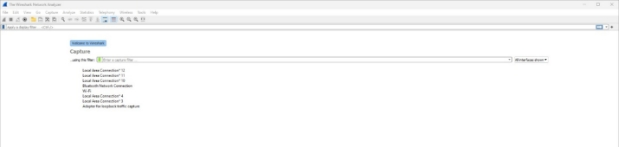
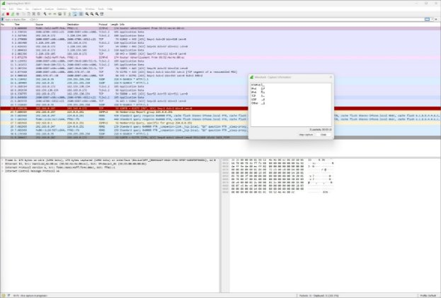
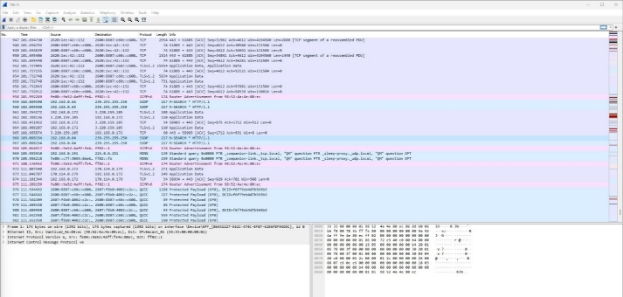
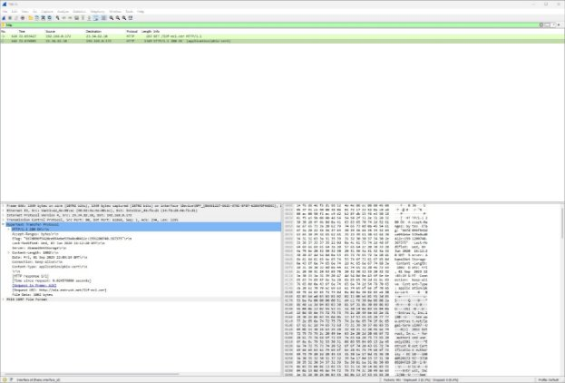
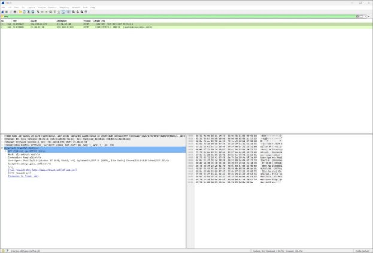

## Lab 0 Report

**Summary**

This lab included the setting and exploration of Wireshark, a packet analyzer that can be used to capture and investigate messages sent over a network.

**Running Wireshark**

Wireshark is an open-source packet sniffer and packet analyzer tool. A packet sniffer is a software tool that can passively capture and inspect data packets on a computer network. A packet analyzer is a software tool that can passively capture data packets on a computer network and provides advanced analysis features to inspect packets. 

The Wireshark packet capture library serves as the underlying infrastructure that allows Wireshark to capture, dissect, and analyze network packets from various network interfaces. The library receives a copy of every data link layer frame sent and received by the computer. A data link layer frame is a data packet format that operates at the data link layer of the OSI or second layer of the TCP/IP model and is responsible for transmitting data over a physical medium (e.g. ethernet cables, Wi-Fi).

After downloading and installing the Wireshark application, a user can launch the application to the startup screen shown in Figure 1.

*Figure 1: Wireshark startup screen*

The user can view the capture interfaces by selecting the Capture button. The interfaces are shown in Figure 2. 

*Figure 2: Wireshark capture interfaces*

Packet capture begins when interfaces are selected. Figure 3 shows packets on the network that were captured by Wireshark. Some common protocols of these messages are TCP, DNS, and SSDP.

*Figure 3: List of packets captured by Wireshark*

To test the capture of HTTP requests, a browser was used to visit a sample web page. The web page is shown in Figure 4.

*Figure 4: Sample web page*

The packets captured by Wireshark when the web page is accessed are shown in Figure 5.

*Figure 5: Packets captured when accessing web page*

Messages matching certain criteria can be filtered. Figure 6 shows Wireshark when a filter is applied to display only HTTP messages.

*Figure 6: Captured HTTP messages from web page*

The computer running Wireshark sent an HTTP GET request message to the web page server and received an HTTP OK message 0.025 seconds after. The address of the web page server is 23.34.82.10 and the address of my computer is 192.168.0.172.

Figure 7 shows the HTTP GET request message. The HTTP protocol information is displayed.

*Figure 7: HTTP GET request message details*
