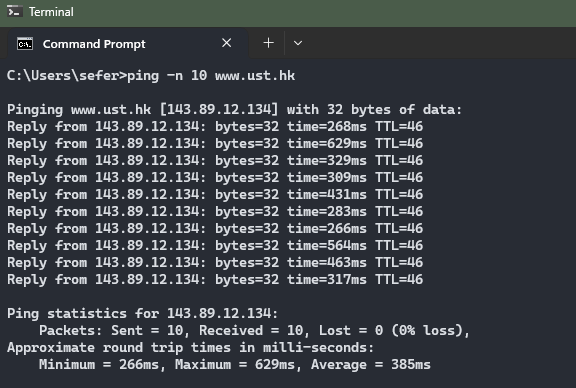
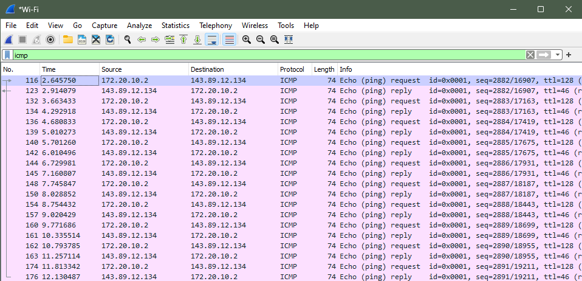
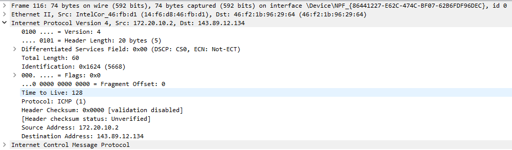
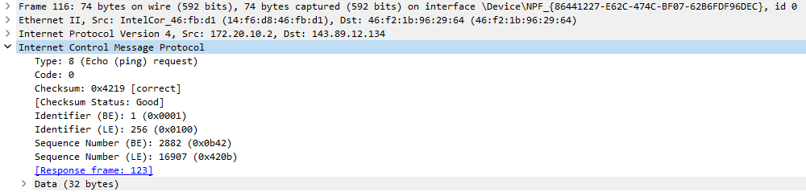
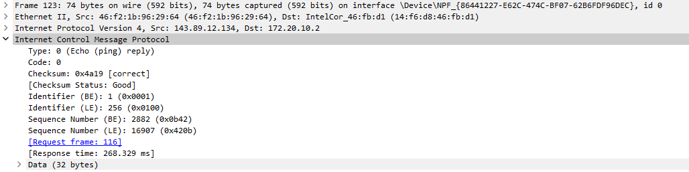

## Lab 1 Report

The Lab 1 recording can be found here: [insert demo link]

**Summary**

This lab included the exploration or ping, ICMP, and traceroute by observing them in action with the Wireshark tool.

### Part 1: ICMP and Ping

Wireshark was used to observe packets on the network resulting from the ping command “ping -n 10 www.ust.hk”. This command sends 10 ping messages to a web server at Hong Kong University of Science and Technology. The resulting output is shown in Figure 1.

*Figure 1: Output resulting from ping command.*

The list of ICMP packets captured by Wireshark following the ping command are shown in Figure 2.

*Figure 2: Captured ICMP packets resulting from ping command.*

Details of the first packet are shown in Figure 3. The IP address of the host, listed in the Source Address field, is 172.20.10.2. The IP address of the destination host, listed in the Destination Address field, is 143.89.12.134.

*Figure 3: Details of first ICMP packet resulting from ping.*

These ICMP packets lack source and destination port numbers because ICMP is a Network Layer protocol. ICMP is typically used for delivering error and control messages, while ports are typically associated with the transport layer.
Details of the ICMP for the first packet are shown in Figure 4. The ICMP type is 8 (Echo (ping) request) and the code number is 0. The packet also contains a checksum, two identifiers, and two sequence numbers which are represented by two bytes each.

*Figure 4: Details of the ICMP packet.*

Details of the ICMP for the reply packet are shown in Figure 5. The ICMP type is 0 (Echo (ping) reply) and the code number is 0. The packet also contains a checksum, two identifiers, and two sequence numbers which are represented by two bytes each.

*Figure 5: Details of the ICMP reply packet*

**Part 2: ICMP and Traceroute**

**Part 3: ICMP and Traceroute using Pingplotter**

