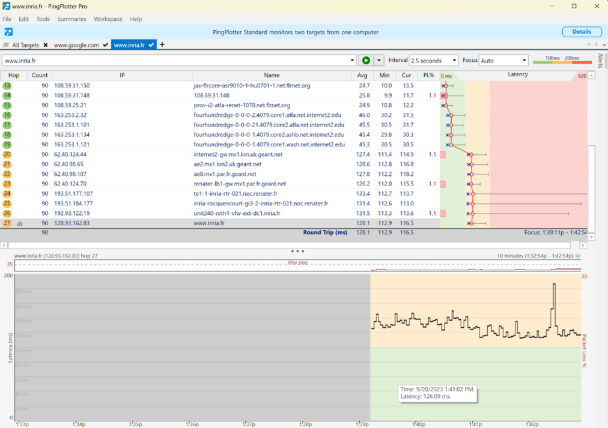
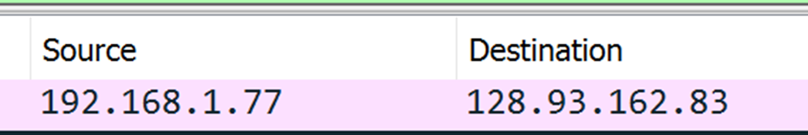
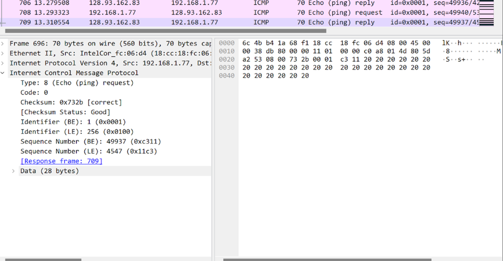
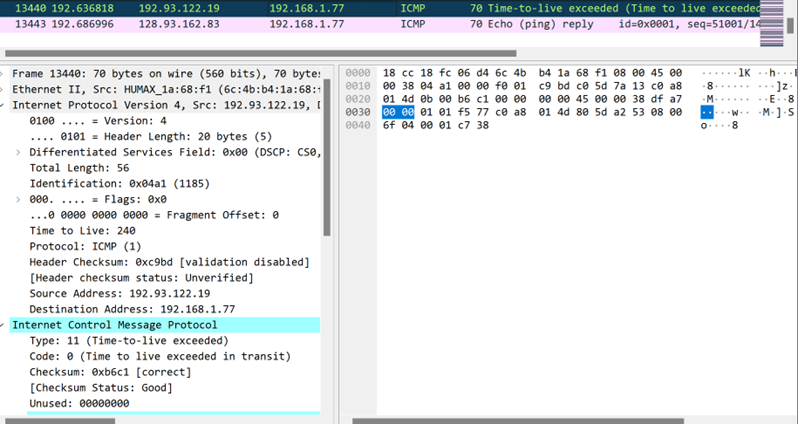

## Lab 1 Report

The Lab 1 recordings can be found here:

Part 1 https://youtu.be/EyCEkO0lNiU
Part 2 https://youtu.be/7ZHbXtvi9Rw
**Summary**

This lab included the exploration or ping, ICMP, and traceroute by observing them in action with the Wireshark tool.

### Part 1: ICMP and Ping

Wireshark was used to observe packets on the network resulting from the ping command “ping -n 10 www.ust.hk”. This command sends 10 ping messages to a web server at Hong Kong University of Science and Technology. The resulting output is shown in Figure 1.

*Figure 1: Output resulting from ping command.*

The list of ICMP packets captured by Wireshark following the ping command are shown in Figure 2.

*Figure 2: Captured ICMP packets resulting from ping command.*

Details of the first packet are shown in Figure 3. The IP address of the host, listed in the Source Address field, is 172.20.10.2. The IP address of the destination host, listed in the Destination Address field, is 143.89.12.134.

*Figure 3: Details of first ICMP packet resulting from ping.*

These ICMP packets lack source and destination port numbers because ICMP is a Network Layer protocol. ICMP is typically used for delivering error and control messages, while ports are typically associated with the transport layer.
Details of the ICMP for the first packet are shown in Figure 4. The ICMP type is 8 (Echo (ping) request) and the code number is 0. The packet also contains a checksum, two identifiers, and two sequence numbers which are represented by two bytes each.

*Figure 4: Details of the ICMP packet.*

Details of the ICMP for the reply packet are shown in Figure 5. The ICMP type is 0 (Echo (ping) reply) and the code number is 0. The packet also contains a checksum, two identifiers, and two sequence numbers which are represented by two bytes each.

*Figure 5: Details of the ICMP reply packet*

### Part 2: ICMP and Traceroute

### Part 3: ICMP and Traceroute using Pingplotter

Figure 1: Screenshot of Pingplotter window

The IP address of our host is 192.168.1.77. The IP address of our target destination host is 128.93.162.83.

Figure 2: IP Address shown from echo request packet

No, the IP Protocol number would be 0x11 (17), the number for UDP

Figure 3: UDP shown with ID number from Wireshark
The Echo Packet is shown below. It is different than that of the first half of the lab, because the source and destination differ, 

The ICMP error packet is shown below. The extra fields include an added checksum, 2 identifiers, and 2 sequence numbers - each adding 2 bytes.
The ICMP packets that are different than the error packets are
Within the tracert measurements, the link whose delay is significantly longer are any who end in “.fr” rather than “.net”. This same idea is mimicked in my lab, where the links ending in “.fr” are longer than the “.net”, most likely because of the distance from here to routers in France, and propagation delay. 

Based on the router names, 
